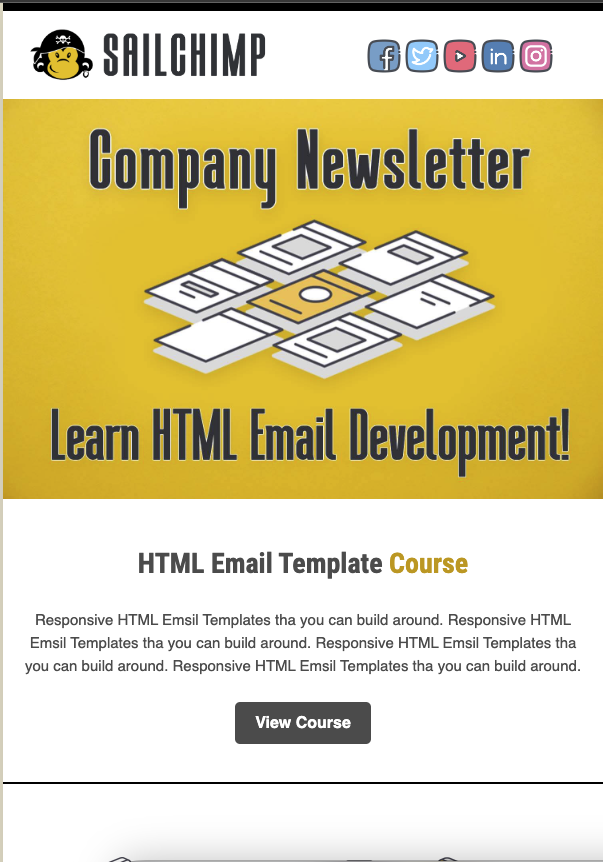
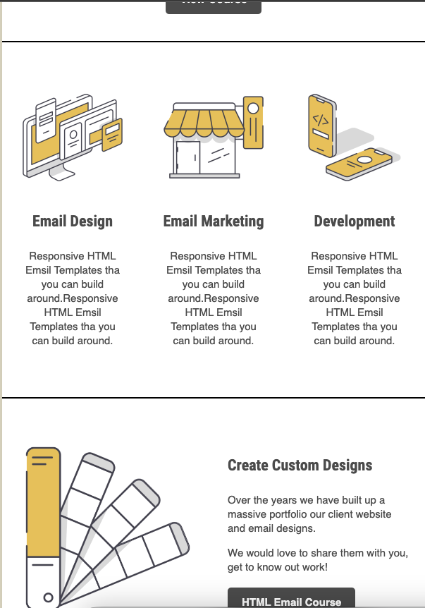
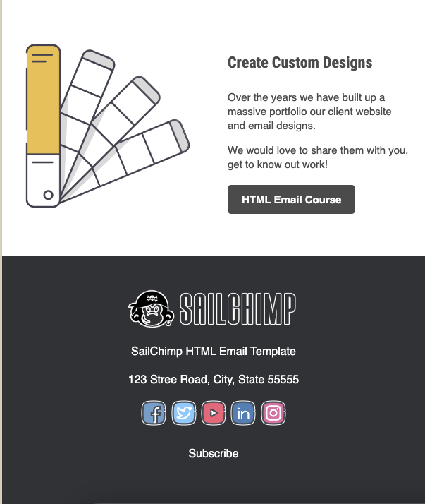

# HTML Email

This project is an HTML Email template designed and developed for various email communication needs. It offers a responsive and visually appealing layout suitable for a wide range of email marketing campaigns, newsletters, and other communication purposes.

## GETTING STARTED

To get started with ChatGPT Clone, follow these simple steps:

### PREREQUISITES

Before you begin, ensure you have met the following requirements:

- A text editor or HTML editor of your choice.
- Basic knowledge of HTML and CSS to customize the template.
- Optionally, you can use a code editor like Visual Studio Code with the Live Server extension for a seamless development experience.

### INSTALLATION

1. Fork this repository to your GitHub account.
2. Clone the forked repository to your local machine:
   ```bash
   git clone https://github.com/iqrasy/html-email
   ```

### USAGE

1. Customize the HTML Email template to meet your specific requirements. You can modify the text, images, and styles as needed.

2. Test the email template in different email clients to ensure it renders correctly.

### PREVIEW





